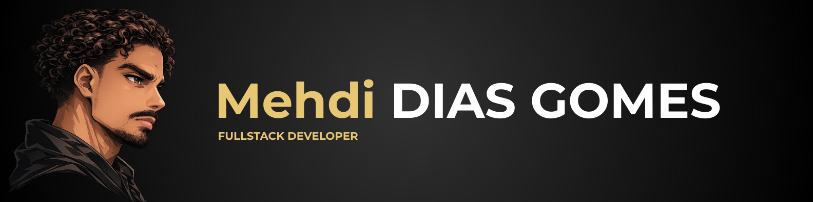

# Hello, I'm Mehdi 👋

## 🚀 About Me

- 🌍 I’m based in Metz, France 🇫🇷.
- 💻 I’m currently working as a Fullstack developer for Flippad.
- 🌱 I’m currently learning Vue.js, Nuxt.js, MySQL, Laravel, Eloquent, PHP, Docker.
- ⚡ I love building dynamic and interactive web applications that provide seamless user experiences.
- 📫 How to reach me: [diasgomes.mehdicours@gmail.com](mailto:diasgomes.mehdicours@gmail.com)

## 🛠️ Technologies & Tools

- **Languages:** TypeScript, JavaScript, PHP, SQL
- **Frameworks:** Vue.js, React, Tailwind.css, NodeJS
- **Tools:** VS Code, GitHub, Docker, Postman, Bun, Pnpm, Zed
- **Databases:** MySQL, MongoDB

