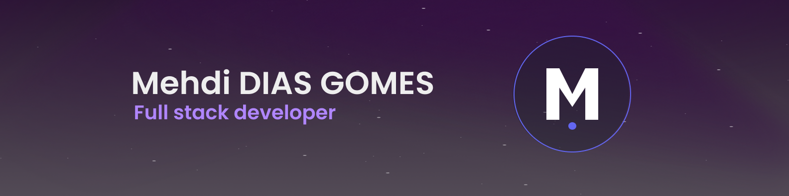

# Hello, I'm Mehdi 👋

## 🚀 About Me
- 🌍 I'm based in Metz, France 🇫🇷.
- 💻 I'm currently working as a Fullstack developer for Maanos in Luxembourg 🇱🇺.
- ⚡ I love building dynamic and interactive web applications that provide seamless user experiences.
- 📫 How to reach me: [diasgomes.mehdicours@gmail.com](mailto:diasgomes.mehdicours@gmail.com)

## 🛠️ Technologies & Tools

### Languages & Frameworks

### Tools & Technologies

### Expertise
- **Backend:** Laravel, Eloquent ORM, RESTful APIs, PHP
- **Frontend:** Vue.js, Nuxt.js, TypeScript, Tailwind CSS
- **DevOps:** Docker, Git
- **Databases:** MySQL, MongoDB

## 📊 GitHub Stats

  

---

  
💜 Thanks for visiting my profile!

